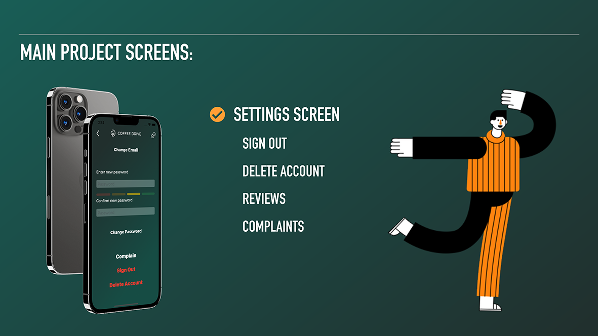

<h1 align="center">

</h1>

## Introduction

Hi, my name is George. I'm glad to see you on my [GitHub](https://github.com/gbasovv?tab=repositories).

## Features

The application is developed in Swift language. I used MVC architecture in my project.
I also created a base class in which I implemented the main functions (according to the third principle of solid)
I brought all the business logic into specially created services (for example: ShowAlert, requests to the server, the function of sorting by date).
For all input fields, when the keyboard appears, a scroll appears, or the keyboard can be hidden by clicking on the retn.
At the first launch of the application, the user is asked to allow notifications and he sees a welcome window with tips on how to place an order.

<h1 align="center">

</h1>
We are all in a hurry on the way to work and we all love to drink coffee in the morning. My app was designed to make life easier for drivers. It allows you to quickly place an order for coffee and goodies, without wasting time in lines. Sweets are located at major gas stations for the convenience of drivers.

<h1 align="center">

</h1>

<h1 align="center">

</h1>

<h1 align="center">

</h1>

<h1 align="center">

</h1>

<h1 align="center">

</h1>
After adding an item, a symbol appears on the cart icon, which makes it clear to the user that there are items in the cart.

<h1 align="center">

</h1>

<h1 align="center">

</h1>

<h1 align="center">

</h1>
If the user decided to enter an empty cart, then the total cost will be zero, and the "order" button will be unavailable.
The second image shows an example of a long swipe to remove an item from the cart.
If the user added items to the cart, but did not place an order and left the application, he will receive a notification reminding him that he has not finished placing the order.

<h1 align="center">

</h1>

<h1 align="center">

</h1>

<h1 align="center">

</h1>

<h1 align="center">

</h1>

<h1 align="center">

</h1>

<h1 align="center">

</h1>
For my project, I used the FireBase framework, on the server of which I store user data, their orders and reviews.
After registration, the user's email, name and phone number are saved on the server. IMAGE 1
After placing an order, an order is created on the server, which is assigned a random number. The server stores all the basic information about the order (name, quantity, size, cost, comment, total cost of the entire order and date of registration). IMAGE 2
If the user left a review / complaint through “complain”, a “complaints” section is created on the server, which contains the name, date and text of the review. IMAGE 3

<h1 align="center">

</h1>

<h1 align="center">

</h1>
Difficulties I faced:

- Find a suitable api. I needed to find one that would have the parameters I needed (well, or at least approximately). Since I did not find this, I made my own local server, from which I get the menu for my app.

- For the logical operation of the application, I needed a cart. To prevent a user from ordering multiple products from creating a million different orders. This complicates the execution of such an order from the side of the coffee cup and it is very easy for the user to get confused. To solve this problem, I used UserDefaults (in the process of placing an order, the goods selected by the user are saved in the phone's memory, and after placing an order, they are deleted).

- After I finished the project, I started testing it and thinking what could be improved. The jamb is that during the creation of the project, I tested it on the simulator and did not use the simulator's keyboard. And only at the end I decided to check, as you might guess, the keyboard overlapped the content and it could not be hidden. But this problem was easily solved by using delegates and observers.

<h1 align="center">

</h1>

<h1 align="center">

</h1>

## Links
- [LinkedIn](https://www.linkedin.com/in/gbasovv/)
- [CV](https://rabota.by/resume/70c51207ff0937633f0039ed1f58594949746f)
- [GitHub](https://github.com/gbasovv?tab=repositories)